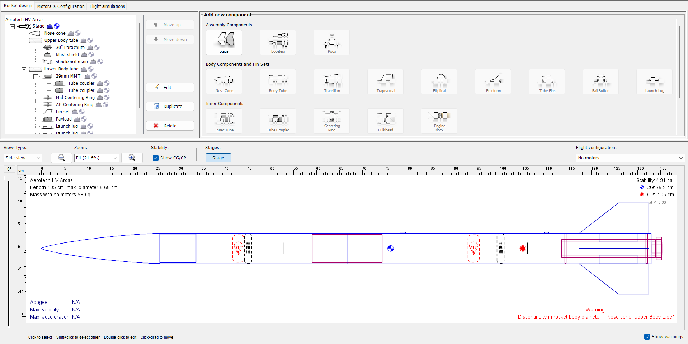
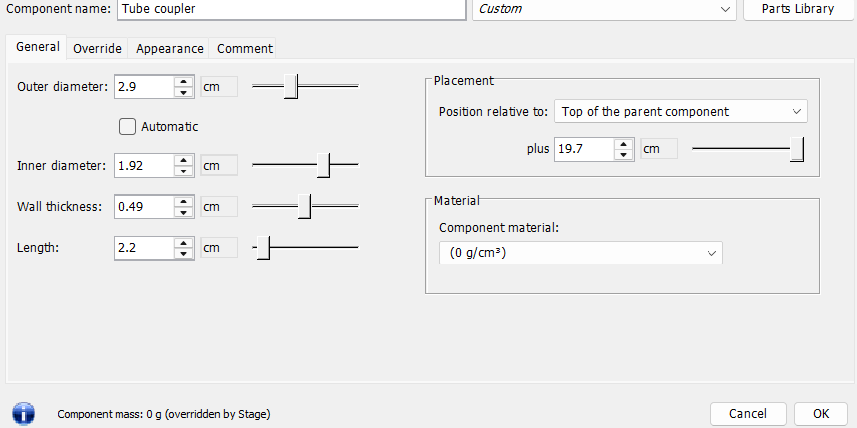
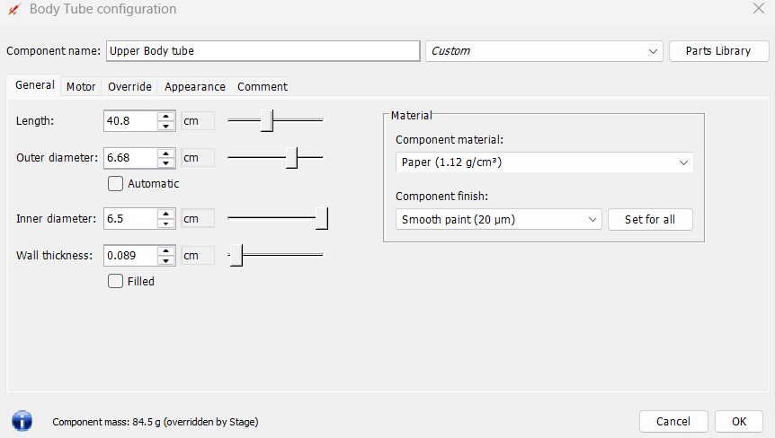
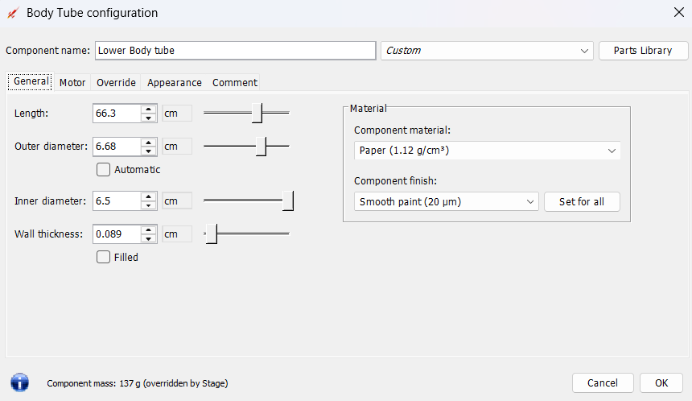
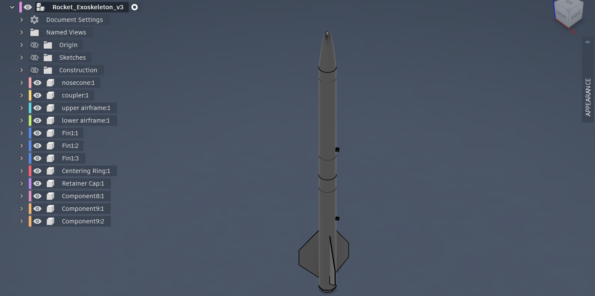
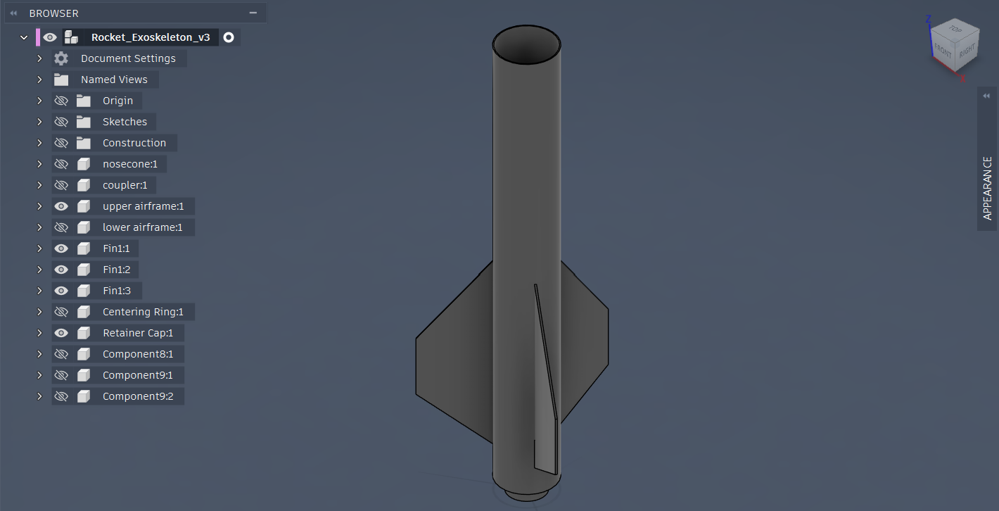
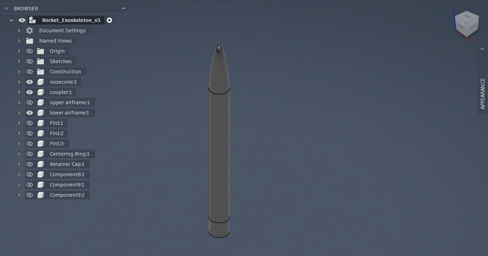
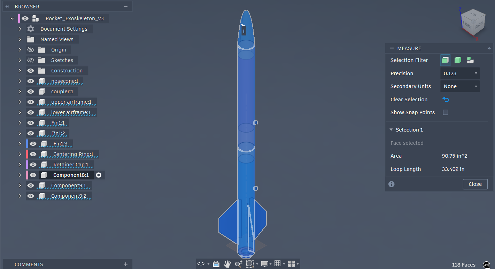
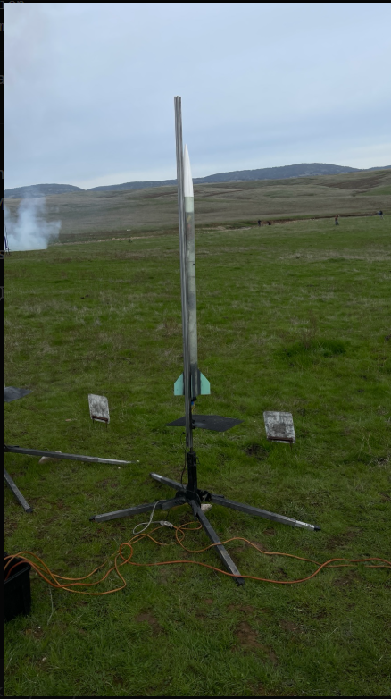
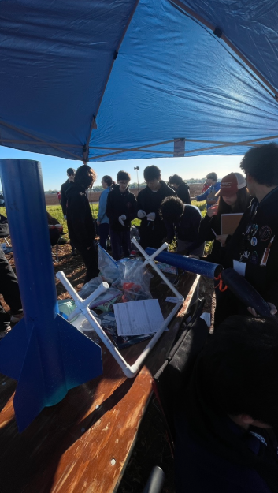

# nasa-student-launch-rocket
# NASA Student Launch Initiative – Subscale Rocket

This repository documents the design, simulation, CAD modeling, fabrication, and launch preparation of a student-built rocket developed for the **NASA Student Launch Initiative (SLI)**.

The goal of the project was to design and build a rocket capable of reaching an altitude of approximately **5000 ft** while maintaining aerodynamic stability and structural integrity.

The project follows the typical aerospace engineering development pipeline:

Simulation → Mechanical Design → Fabrication → Launch

---

# Project Overview

The rocket was designed using a combination of simulation and CAD tools before being physically assembled and prepared for launch. The workflow allowed the team to evaluate flight stability, design structural components, and validate the rocket configuration before fabrication.

Key design goals included:

- Achieve a target altitude of **5000 ft**
- Maintain stable aerodynamic flight
- Design a modular airframe structure
- Integrate propulsion and structural components
- Prepare the rocket for launch operations

---

# Rocket Simulation (RockSim)

The rocket configuration was first modeled in **RockSim**, a simulation software used in high-power rocketry to evaluate aerodynamic stability and flight performance.

The simulation defines:

- rocket geometry
- internal component layout
- airframe structure
- coupler connections
- mass distribution

Key simulation parameters:

- **Total Length:** 135 cm  
- **Maximum Diameter:** 6.68 cm  
- **Mass (without motor):** 680 g  

RockSim calculates the **Center of Gravity (CG)** and **Center of Pressure (CP)** to verify rocket stability. For stable flight, the CG must remain ahead of the CP.

## Rocket Simulation Layout

---

## Airframe Coupler Design

The rocket airframe is divided into modular sections connected using **internal tube couplers**. These couplers maintain alignment between body tubes and allow modular assembly of the rocket structure.

---

## Upper Airframe Section

The upper body tube forms the forward structural section of the rocket airframe and houses internal components such as payload or recovery systems.

---

## Lower Airframe Section

The lower airframe section supports the propulsion system and fin assembly. This section must withstand the thrust forces generated during rocket motor ignition.

---

# CAD Structural Design (Fusion 360)

After defining the rocket configuration in simulation software, the rocket was modeled in **Autodesk Fusion 360** to create a mechanical representation of the airframe structure.

The CAD model represents the rocket as a multi-component assembly including:

- nose cone
- airframe sections
- couplers
- fins
- centering rings
- motor retention hardware

## Full Rocket CAD Assembly

---

## Fin and Propulsion Section

The rear section of the rocket includes a **three-fin stabilization system** which maintains aerodynamic stability during flight.

---

## Nose and Upper Airframe

The forward section of the rocket includes the nose cone and upper airframe connection which houses internal rocket systems.

---

## CAD Dimensional Inspection

The Fusion 360 model allows dimensional inspection of rocket components to verify structural measurements and ensure compatibility with the simulation design.

---

# Fabrication and Assembly Tooling

To support rocket assembly and handling during construction, a **custom rocket support cradle** was designed and fabricated.

The cradle structure was constructed using:

- 0.5 inch wood panels
- 1×1 wood structural supports
- 3D printed components

## Cradle Design Layout

---

## Completed Assembly Cradle

This fixture allowed the rocket to be safely supported during assembly and integration.

---

# Launch Preparation

Following simulation, CAD design, and fabrication, the rocket was assembled and prepared for launch testing in a field environment.

## Rocket Assembly

---

## Rocket Mounted on Launch Rail

---

# Launch Demonstration

The rocket was successfully mounted on a launch rail and launched during field testing.

🎥 **Launch Video:**  
https://docs.google.com/videos/d/1sJ2aHxnOiBoEbLTheDI1SmxcggfWsaBT2amn7sEnF-I/edit?usp=sharing

---

# Software and Tools Used

### Simulation
- RockSim

### CAD Modeling
- Autodesk Fusion 360

### Fabrication
- Wood construction
- 3D printed components

### Launch Equipment
- High-power rocket launch rail system

---

# Repository Structure

design/ – RockSim simulation screenshots  
cad/ – Fusion 360 CAD models and images  
fabrication/ – rocket cradle design and build  
launch/ – rocket assembly and launch photos  
simulation/ – RockSim project file
